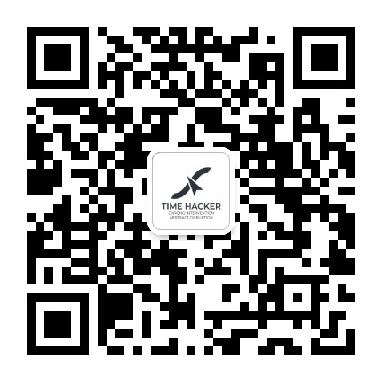

# 太虚五转：Vibe Coding 时代的认知流水线

> 一套给 AI 用的认知方法论 Skill 包：把「发散 → 收敛 → 验证 → 审查 → 归真」变成可执行、可强制、可迭代的工程管线。


## 这是什么

太虚五转是一套认知方法论 Skill 包，为 [Claude Code](https://docs.anthropic.com/en/docs/claude-code) 等 AI Agent 平台设计。

**核心问题**：AI 给你的方案，从「想到」到「靠谱」之间，有很长的路。它帮你找到方案，但方案的前提对不对？它帮你审查漏洞，但审完之后，被否掉的东西里有没有被误杀的？这些中间环节，单个 Prompt 解决不了。

**太虚五转的解法**：把认知过程拆成五步（发散、收敛、验证、审查、归真），每一步做成一个独立 Skill，可以单独用，也可以一键连招。

## 目录

- [底层逻辑](#底层逻辑两套核心框架)
- [太虚五转](#太虚五转)
  - [一转·散怀（Osborn）](#一转散怀osborn)
  - [二转·澄源（Hegel）](#二转澄源hegel)
  - [三转·叩实（Bayes）](#三转叩实bayes)
  - [四转·破妄（Feynman）](#四转破妄feynman)
  - [五转·归真（Debono）](#五转归真debono)
- [连招：taixu-pipeline](#连招taixu-pipeline)
- [外围 Skill：Socrates](#外围-skillsocrates)
- [应用场景](#应用场景)
- [安装](#安装)
- [使用](#使用)
- [未来规划](#未来规划)

---

## 底层逻辑：两套核心框架

方法论不是凭空设计的。太虚五转的底层，是两套核心框架：一个管「确定性的问题」，一个管「非确定性的问题」。

### 框架一：第一性原理 + 贝叶斯公式 + 奥卡姆剃刀法则

出处是孟岩老师的播客《无人知晓》E45《人何以自处》，嘉宾是李继刚老师。他分享了自己的思考框架：「万有理论 + 贝叶斯公式 + 奥卡姆剃刀法则」。

这三个不是随便挑的公式，搭在一起才看出整体的力量：

- **贝叶斯公式**是最底层的。人的认知带宽有限，宇宙的信号无限，先验永远是片面的。所以它必然带来两个品质。信仰贝叶斯的人，谦卑和开放不是表演出来的，而是他的底色：一是谦卑，因为别人可能有你没有的取景框；二是开放，因为新信息是更新先验的唯一途径。
- **奥卡姆剃刀**讲的是「如无必要，勿增实体」。面对一千个变量，大部分是表象，只有少数几个是维度级的，它们构建了坐标系。找到这几个，就找到了秩。
- **万有理论**是思考的终极方向：纷繁现象下面，应该有一个最简洁的框架能统摄一切。

这个框架的隐含假设是：世界是可知的、收敛的。确定性问题（代码、数学），这个假设成立。但万有理论至今没找到，所以我把它修正为「第一性原理」：万物都可以一层层往下拆。

### 框架二：有界贝叶斯 + 相变识别 + 时间成本最优

组织决策、社会演化、技术选型这些非确定性问题，第一个框架失灵了。失灵的深层原因不是「系统太复杂」，而是更根本的：你可能根本没有「下一轮」去更新先验。一条河的平均深度是 1 米，但如果你在某一步踩到 3 米深的坑，你就淹死了。

所以第二个框架是第一个的辩证修正：

- **有界贝叶斯**：贝叶斯假定你可以一直更新先验，但有界贝叶斯加了一个硬约束：你可能被踢出局，没有「下一轮」。证伪证据的权重远高于证实证据：一万只白天鹅不能证明「所有天鹅都是白的」，一只黑天鹅就能推翻它。
- **相变识别**：奥卡姆帮你找到维度级变量，但复杂系统最危险的地方是：这几个变量一直正确工作，直到某个临界点突然全部失效。水在 99°C 和 101°C 的区别不是「更热一点」，而是液态和气态的质变。相变识别监测的是「规则本身是否正在改变」。
- **时间成本最优**：确定性问题追求「找到正确答案」，非确定性问题是在一条只有单程票的时间线上做选择。首要目标不是「找到最优方案」，而是「确保系统可用、团队还能迭代」。先活下来，再谈最优。

**反脆弱**跟第二个框架是同一件事：肥尾效应就是相变识别的另一面，杠铃策略就是时间成本最优的操作层落地。

说到底就是一句话：算得清的算清楚，算不清的别硬算。前者靠脑力，后者靠心力。

---

## 太虚五转

根据这两套框架，衍生出 5 个 Skill，每个对应一位大师级人物，形成一套组合拳。

| 转 | Skill | 大师 | 中文名 | 核心职责 |
|:--:|-------|------|--------|----------|
| 一 | osborn | Alex Osborn | 散怀 | 发散思维，把可能性空间铺开 |
| 二 | hegel | 黑格尔 | 澄源 | 迭代收敛，把发散的东西收拢 |
| 三 | bayes | 贝叶斯 | 叩实 | 事实验证，拿真实数据打脸 |
| 四 | feynman | 费曼 | 破妄 | 输出审查，找自欺的点 |
| 五 | debono | 德·博诺 | 归真 | 价值回溯，捡回被误杀的 |

五个 Skill 串在一起，就是一条完整的认知链路：**发散 → 收敛 → 验证 → 审查 → 归真**。

### 一转·散怀（Osborn）

**对应大师：Alex Osborn，头脑风暴之父**

面对一个问题，脑子里第一个冒出来的想法，往往会把后面的可能性全排除掉。这叫**收敛过早**。

AI 更严重。一旦 Agent 生成初始想法，就锚定了，后面所有推理围绕这个方向展开。这不是哪个模型的问题，是所有自回归语言模型的结构性问题：Token 顺序生成，前面的 token 构成后面 token 的上下文。模型一旦写下「方案一：用 Redis 做分布式锁」，后面就不会认真想「也许根本不需要分布式锁」。

**Osborn 的解法**：先不评判、不筛选、不排序，量先到位。然后用 SCAMPER 七算子（替代、组合、改造、修改、它用、去除、反转）做结构化补盲，再换几个视角（用户、技术、竞争对手、极端情况）扫剩下的死角。

**案例**：评估一个三方联动方案（PRD 状态流转自动识别 → 调 diagram skill 画图 → 调 handihe 出原型）。跑了一轮 Osborn，出了 68 个想法。

其中 SCAMPER 的反转算子问了一句「能不能从原型反推图表？」，跟原方案思路完全反过来。去除算子逼出了「事前确认还是事后修正」的取舍。改造算子借鉴编译器 AST，想把 PRD 当源代码建一套「业务规则 AST」再生成图表，设计上最重，但启发也最大。

不发散，你只看到一条路。发散完才发现，第一条路未必是对的。

### 二转·澄源（Hegel）

**对应大师：黑格尔，辩证法**

发散完了，68 个想法摊在那儿。哪些是真问题？哪些互相矛盾？

**Hegel 的解法**：把几种分析方法串成自动循环管线，每轮走三步：校准、挑战、深化。迭代收敛了就停，没收敛就再来一轮。

- **校准**：这个判断有证据吗？置信度多少？
- **挑战**：主动找茬，攻击自己的结论。
- **深化**：活下来的结论再往下挖一层，根因是什么？边界在哪？

**关键设计：零假设检验**。不只找问题，还要问「如果原方案没问题，应该看到什么证据？」，这个设计是后来因 Feynman 审查发现流程偏差才加上的。

**案例**（续上）：68 个想法进 Hegel，跑 6 轮迭代，收成 10 个 finding。最要命的一条被标了 CRITICAL：「状态流转自动识别是个伪命题」：PRD 里写状态的方式五花八门，靠启发式规则根本泛化不了。后验风险从 0.70 降到 0.55 再到 0.40，三轮才稳住。最终裁定：**条件发布**，10 个 finding 里 8 个收敛了。

### 三转·叩实（Bayes）

**对应大师：贝叶斯，概率论之父**

10 个 finding 都有了置信度，但这是 AI 估的，靠谱吗？

**Bayes 的解法**：把每条结论拆成可查证的预测：「如果这个判断成立，那 A、B、C 应该是这样」。然后拿真实代码、读协议文件、交叉对比去验。被打脸的地方就是认知盲区，打得越狠收获越大。

为什么要交叉验证？因为同一条分析链路可能有共同盲点。两个独立视角看同一段代码，结论一致才算数，不一致本身就是信号。

**案例**（续上）：Hegel 说「B 类内容可以直接删掉，省 80 行」。Bayes 去代码里一查，134 行 B 类内容里只有 28 行在协议文件里有等价表述能直接删，剩下 106 行得先补协议文件。说好的 80 行，实际能砍的 28 行。

Hegel 的推理没毛病，但推理的前提是猜的。Bayes 干的事就是拿真东西去验这些猜。

### 四转·破妄（Feynman）

**对应大师：费曼，物理学家**

核心就是**对抗式审查**，但比简单的审查多了一层：BUG 好找，自欺难防。

AI 有一个倾向：自圆其说。费曼说「你不能欺骗自己」，但自欺最难防。

**六条原则**，借鉴了卡帕西 Claude.md 的核心原则，扩展到更广泛的领域：

| 原则 | 防的自欺类型 | 什么意思 |
|------|------------|-----------|
| P1 停下来想 | 假设未验证 | 「我觉得是这样」，你觉得不算数 |
| P2 不确定性诚实 | 伪装确定性 | 「这个值肯定是 X」，你把猜测写成了事实 |
| P3 设计要简 | 过度设计 | 「万一以后需要呢」，你在为不存在的需求写代码 |
| P4 执行要准 | 附带伤害 | 「顺手改一下」，你在制造无法追溯的变更 |
| P5 验收要闭环 | 自证清白 | 「应该没问题」，你在用想象替代实验 |
| P6 数据要溯源 | 真相漂移 | 「这里也写一份」，你在制造终将偏离的副本 |

**关键设计：独立 subAgent 隔离**。审查员只看变更产物，看不到对话历史。隔离的是上下文，不是能力：审查者拿到的是 diff + 原则 + checklist，没有你的推理过程，没有「为什么这样改」的解释。同一个 Agent 写的代码自己审，上下文全是辩护理由。把理由拿掉，代码还站得住，那才算真站得住。

**案例**（续上）：Feynman 审完判了「不建议发布」，理由看起来很充分。但这正好暴露了一个问题：审查者用的标尺本身也需要被审查。这就要靠第五转。

### 五转·归真（Debono）

**对应大师：爱德华·德·博诺，六顶思考帽的提出者**

前四转形成了一条强大的批判管线，但批判管线有盲区：**它擅长排除，不擅长保留**。批判有时下手太重，把有价值的东西连同不可靠的部分一起扔掉了。

**Debono 的解法**：给被否掉的命题做逆向价值扫描。不问「为什么错」，问「什么情况下它对」。

五种构建策略：

- **S1 逆向利益相关方**：找到被批判视角忽略的群体，分析他们为何受益
- **S2 条件缩窄法**：把适用条件一步步收窄，找到「范围虽小但确实成立」的区间
- **S3 时间延迟价值**：往后看，什么条件变了会让它重新有价值
- **S4 类比复活法**：在别的领域找类似的、已经跑通的案例
- **S5 反面代价法**：不采纳的话，会丢掉什么机会

**案例**（续上）：Feynman 否决的 6 条命题全部起死回生。比如「30 秒统一超时」被批为拍脑袋，但 Debono 查了一圈业界：AWS CloudFormation、Kubernetes、Docker Build 都倾向统一超时。降低用户心智负担本身就是工程智慧，不是无知。最终结论从「不建议发布」翻转为：**立即发布，分阶段改进**。

费曼帮你排除坏的，但有时候好的也被一起排除了。Debono 就是从废墟里翻东西的那个人。

> 搭完框架后发现，五转跟德·博诺的「六顶思考帽」暗合：前四转对应绿帽（发散）、蓝帽（收敛）、白帽（事实）、黑帽（批判），第五转补上黄帽（价值肯定）。唯一没做成 Skill 的是红帽：直觉和情感是人独有的东西，不该交给大模型。

---

## 连招：taixu-pipeline

五个 Skill 可以单独用，也可以串成连招。

`taixu-pipeline` 是一个编排器，一键串联 osborn → hegel → bayes → feynman → debono，保证完整五转流程不被降级。

**核心特性**：

- **CHECKPOINT**：每步之间暂停，展示状态卡片（耗时、信号、偏离值），可选择继续 / 跳过 / 终止 / 重跑
- **选择性执行**：`--steps hegel,bayes` 只跑其中几步
- **防嵌套机制**：Hegel 内部会调用 Bayes 和 Feynman，pipeline 调用 Hegel 时传 `--standalone` 跳过内嵌调用，由后续独立 Skill 完整跑
- **时间日志**：全程追踪各步耗时，用于 retro 分析和典型值校准

**完整五转案例数据**：

| 转 | Skill | 做了什么 | 核心数字 |
|:--:|-------|---------|---------|
| 一 | Osborn | 68 个想法，SCAMPER 逼出反直觉角度 | P1:21, P2a:26, P2b:21 |
| 二 | Hegel | 6 轮迭代，CRITICAL 风险三轮才稳住 | 10 finding → 8/10 收敛，风险 0.70→0.40 |
| 三 | Bayes | 拿真代码验证 Hegel 的建议 | 预估省 80 行，实际能省 28 行 |
| 四 | Feynman | 六原则自欺审查 | 3 HIGH + 3 MEDIUM，判定不建议发布 |
| 五 | Debono | 6 条被否命题全找到存活理由 | 推翻「不建议发布」，改为立即发布+分阶段改 |

五转之前，目标是「评估方案能不能做」。五转之后，结论变了：卡住的不是方案本身，是「完美主义标准太高」。

---

## 外围 Skill：Socrates

太虚五转管的是「自己的推理和产出」。但日常工作中，你每天都会碰到大量外部观点：行业分析、竞品报告、媒体报道、论坛帖子。

费曼防的是自欺，审的是自己写的东西。外部观点的问题不是你会自欺，是别人可能在忽悠你。

**Socrates** 用苏格拉底诘问法的三个维度审查外部论点：

- **事实核查**：数据有没有选择性引用？案例描述有没有失真？外部论点最常见的手法不是撒谎，是只呈现部分真相。
- **对称性检查**：这个批评是否同样适用于对照组？双方都有的毛病只拿一方说事，那叫修辞，不叫分析。
- **独立性检查**：去掉这条论点，其他论点还成立吗？看似五六条论据，其实拴在一根绳上，抽掉一根全盘崩塌。

| 维度 | Feynman 费曼审查 | Socrates 苏格拉底诘问 |
|------|-----------------|---------------------|
| 审查对象 | 自己的推理/产出 | 外部论点/观点 |
| 方向 | 内省 | 外审 |
| 核心问题 | 我哪里可能自欺？ | 对手的论证可靠吗？ |
| 方法论 | 六条自欺原则 | 三维度审查（事实+对称性+独立性） |
| 执行方式 | 独立 subAgent，隔离上下文 | 调用 bayes 做事实核查 |
| 使用场景 | 写完代码/方案后、提交前 | 看到第三方分析/行业观点后 |

Socrates 不在连招管线里，因为触发条件不同：五转是产出时主动跑的，Socrates 是看到外部观点时按需触发的。两者互补，一个管内部质量，一个管外部输入。

---

## 应用场景

太虚五转处理的是认知本身的问题，跟具体领域无关。

- **产品技术方案评估**：Osborn 发散所有集成路径 → Hegel 收敛核心风险 → Bayes 验证前提是否成立 → Feynman 审查有没有自欺 → Debono 捡回被误杀的方案
- **投资分析**：Osborn 发散所有角度 → Hegel 收敛核心判断 → Bayes 拿真实数据验 → Feynman 审查有没有骗自己 → Debono 看被否的标的是否真没价值
- **架构决策**：Osborn 铺开所有方案 → Hegel 收敛找盲区 → Bayes 查代码验证 → Feynman 找流程级偏差 → Debono 捡回被过度批判的设计
- **内容创作**：Osborn 发散切入角度 → Hegel 收敛论点结构 → Bayes 验证引用数据 → Feynman 审查论证有没有自欺 → Debono 看被删段落里有没有误杀的好观点

发散管空间，收敛管方向，验证管事实，审查管自欺，归真管价值。

---

## 安装

### 方式一：Claude Code

```bash
# 克隆仓库
git clone git@github.com:fainshare/Liam-Skills.git

# 复制需要的 skill 到 Claude Code 的 skills 目录
cp -r Liam-Skills/skills/osborn ~/.claude/skills/
cp -r Liam-Skills/skills/hegel ~/.claude/skills/
# ... 按需复制其他 skill
```

### 方式二：通用安装

每个 Skill 是一个独立的 `SKILL.md` 文件，兼容支持 SKILL.md 规范的 AI Agent 平台（Claude Code、Qoder、Aone Copilot 等）。将 `skills/` 目录下的对应 Skill 复制到你的平台 skills 目录即可。

### 依赖

- 支持 SKILL.md 规范的 AI Agent 平台
- Bash 执行环境（部分 Skill 需要调用 shell 命令做验证）

---

## 使用

### 单独使用

在对话中直接触发对应 Skill：

```
# 发散
帮我发散一下这个方案的可行性
# 收敛
帮我收敛这些想法，找出核心问题
# 验证
帮我验证这个判断是否成立
# 审查
审查一下我刚写的代码/方案
# 归真
看看被否掉的方案里有没有被误杀的
```

### 一键连招

```
跑五转 / 一键五转 / taixu-pipeline
```

pipeline 会自动串联五步，每步之间暂停让你确认。

### 选择性执行

```
--steps hegel,bayes  # 只跑收敛和验证
```

---

## 未来规划

### 当前状态

6 个 Skill（太虚五转 + Socrates）+ 1 个编排器（taixu-pipeline）已开源。每个 Skill 可单独使用，也可连招。

### 下一步：打破单 Agent 天花板

当前五转流程在每一步内部，仍然是单 Agent 在做。这带来一个结构性限制：**注意力隧道效应**。

当模型沿一条推理路径深入时，会逐渐「看不到」其他维度的问题。这不是模型笨，而是 Transformer 注意力的结构性限制：上下文越长，早期 token 的影响力越弱。Agent 处理到第一万行 token 的时候，对第一行 token 的注意力已经衰减得很厉害了。

**借鉴方向**（参考 UltraPlan 的多 Agent 架构）：

- **发散阶段**：不只是一个 Agent 闷头想，而是多个 Agent 各自带不同视角并行发散，然后合并想法池
- **验证阶段**：引入独立 Agent 做交叉验证。两个独立视角看同一段产物，结论一致才算数，不一致本身就是信号
- **全流程**：在关键节点引入异构 Agent 做审查，打破单一推理路径的注意力隧道

核心目标：让五转流程从「一个 Agent 换五顶帽子」变成「多个 Agent 各司其职、交叉验证」。

### 方法论自审

太虚五转 2.0 正在构建评估体系：定义评分维度、跑盲审、找偏差。用五转审一切，谁来审五转本身？答案是：五转审自己。用 Feynman 审查五转流程的偏差，用 Debono 捡回被过度批判的步骤。这套方法论不是一天想出来的，也不会在今天停住。

---

## License

MIT

---

<div align="center">
  

  扫码关注公众号「时间黑客」
</div>
